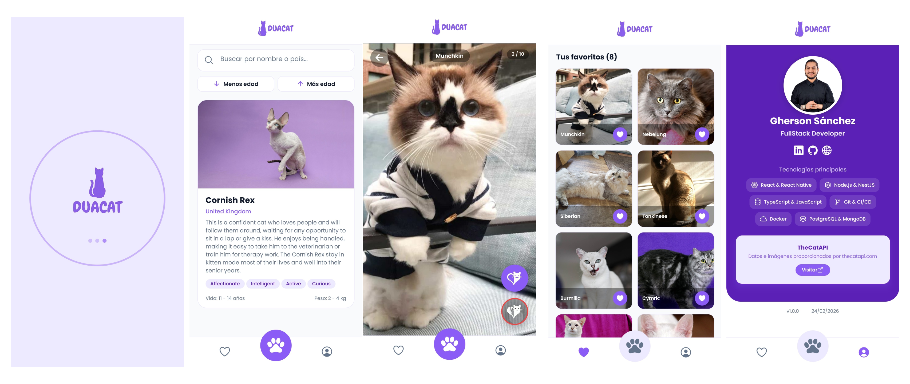

# 🐱 DuaCat — Prueba técnica React Native

Aplicación móvil desarrollada como prueba técnica para **Duacode / Lãberit**, construida con **React Native + Expo**.

Explora razas de gatos, visualiza sus imágenes en scroll vertical estilo TikTok, vota tus favoritas y gestiona tu colección personal.

---

<p align="center">
  
</p>

<p align="center">
  <a href="https://www.figma.com/design/XOWEVQpzN5RizwhO2XxCRM/Untitled?node-id=0-1&t=wq14X9s8zuWEAET9-1">🎨 Ver prototipo en Figma</a>
</p>

---

## 🧠 Decisiones Técnicas

Durante el desarrollo (limitado al plazo de la prueba), se tomaron las siguientes decisiones arquitectónicas:

- **TanStack React Query:** Elegido frente a `useEffect` tradicionales para manejar eficientemente la caché de las imágenes, los estados de carga (loading/error) y simplificar enormemente la lógica del scroll infinito (`useInfiniteQuery`).
- **Zustand:** Se optó por Zustand sobre Redux o Context API por su minimalismo y nulo boilerplate, ideal para manejar el estado global de los votos (Likes/Dislikes) de forma rápida y sin penalizar el rendimiento.
- **NativeWind:** Permite mantener la consistencia del diseño (Design System) de Figma en el código usando clases utilitarias, acelerando el desarrollo UI sin sacrificar el rendimiento nativo.
- **Arquitectura Modular (Barrel Exports):** Se implementó una estructura basada en `index.ts` en las carpetas principales para mantener importaciones limpias y evitar el "infierno de rutas relativas".

## 📸 Características

- **Exploración de razas** — Scroll horizontal con snap, búsqueda por nombre/país y ordenación por esperanza de vida
- **Detalle de raza** — Scroll vertical infinito de imágenes con paginación
- **Sistema de votos** — Like/dislike con animaciones spring, sincronizado con TheCatAPI
- **Favoritos** — Grid de imágenes favoritas con acceso directo al detalle
- **About** — Perfil del desarrollador, tecnologías y enlaces sociales

## � Futuras Mejoras (Próximos pasos)

Si el proyecto continuara su desarrollo para un entorno de producción real, estas serían las prioridades:

1. **Testing Automático:** Implementar pruebas unitarias y de componentes usando `Jest` y `React Native Testing Library`.
2. **Persistencia Offline:** Usar `AsyncStorage` o `MMKV` para guardar los gatos favoritos localmente y permitir acceso sin conexión.
3. **Animaciones Avanzadas:** Migrar algunas transiciones a `React Native Reanimated` para asegurar 60fps en dispositivos de gama baja.
4. **CI/CD:** Configurar flujos de GitHub Actions o EAS (Expo Application Services) para automatizar los builds y testeos antes de cada despliegue.

## �🛠️ Stack Tecnológico

| Tecnología | Uso |
|---|---|
| **Expo SDK 54** | Plataforma base |
| **React Native 0.81** | Framework UI |
| **TypeScript** | Tipado estático |
| **NativeWind v4** | Estilos con Tailwind CSS |
| **TanStack React Query** | Fetching y caché de datos |
| **Zustand** | Estado global (votos) |
| **Axios** | Cliente HTTP |
| **React Navigation** | Navegación por tabs |
| **Poppins** | Tipografía personalizada |

## 📁 Estructura del Proyecto

```
src/
├── api/              # Cliente HTTP y endpoints (breeds, images, votes)
├── components/
│   ├── layout/       # Header, TabBar
│   └── ui/           # LoadingScreen, SearchBar, Skeleton
├── hooks/            # useBreeds, useBreedImages, useAppFonts
├── navigation/       # AppNavigator (Bottom Tabs)
├── screens/          # CatsScreen, BreedDetailScreen, FavoritesScreen, AboutScreen
├── store/            # votesStore (Zustand)
├── types/            # Interfaces TypeScript
└── utils/            # Constantes y configuración
```

## 🚀 Instalación y Ejecución

### Requisitos previos

- Node.js 18+
- npm o yarn
- Expo Go en tu dispositivo móvil (o un emulador)

### Pasos

1. **Clonar el repositorio**
   ```bash
   git clone https://github.com/GhersonSA/cat-duacode-app.git
   cd cat-duacode-app
   ```

2. **Instalar dependencias**
   ```bash
   npm install
   ```

3. **Configurar variables de entorno**
   ```bash
   cp .env.example .env
   ```
   Edita `.env` y añade tu API key de [TheCatAPI](https://thecatapi.com/):
   ```
   CAT_API_KEY=tu_api_key_aqui
   ```

4. **Ejecutar la aplicación**
   ```bash
   npx expo start --clear
   ```
   Escanea el QR con Expo Go o presiona `a` para Android / `i` para iOS.

## 🎨 Paleta de Colores

| Color | Hex | Uso |
|---|---|---|
| Brand | `#8B5CF6` | Color principal |
| Brand Light | `#EDE9FE` | Fondos suaves, chips |
| Brand Dark | `#5B21B6` | Acentos oscuros |
| Surface | `#F8FAFC` | Fondo de pantallas |
| Text Main | `#0F172A` | Texto principal |
| Text Muted | `#64748B` | Texto secundario |

## 📄 API

Datos e imágenes proporcionados por [TheCatAPI](https://thecatapi.com/).

## 👤 Autor

**Gherson Sánchez** — FullStack Developer

- [LinkedIn](https://www.linkedin.com/in/gherson-sa/)
- [GitHub](https://github.com/GhersonSA)
- [Portfolio](https://ghersonsa.com/)

## 📝 Licencia

Este proyecto está bajo la licencia MIT. Ver [LICENSE](LICENSE) para más detalles.
